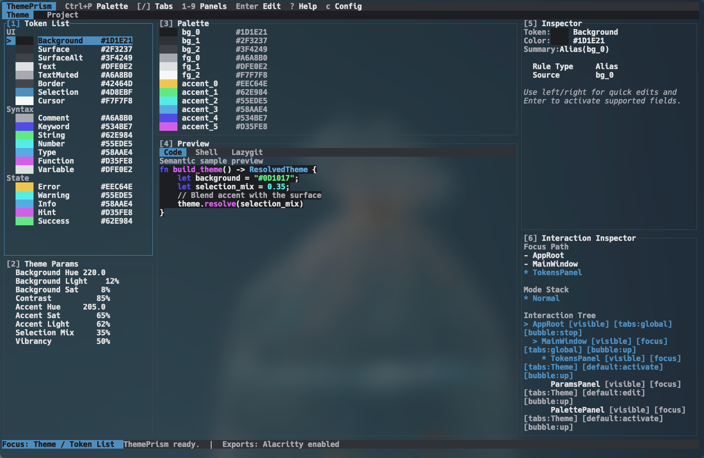

# ThemePrism

ThemePrism is a Rust theme design tool for terminal and editor color systems. It combines a keyboard-first TUI, a native macOS GUI, a semantic token model, and a template-driven export pipeline.



## Highlights

- Keyboard-first TUI with command palette, hint navigation, inspector editing, and fullscreen panels
- Native macOS GUI for a more visual editing workflow
- Semantic token and palette editing backed by a shared Rust core
- Real preview workspace for code and terminal-oriented theme evaluation
- Template-based export engine with typed placeholders and filter chains
- Managed-block patching for Alacritty, so theme colors can be updated without overwriting unrelated config

## Run

Start the default TUI:

```bash
cargo run
```

Start the GUI explicitly:

```bash
cargo run -- --platform gui
```

## Export

ThemePrism exports through templates instead of app-specific exporters. Templates can read values from:

- `meta.*`
- `token.*`
- `palette.*`
- `param.*`

Example placeholders:

```text
{{token.comment}}
{{token.comment | opaque_hex}}
{{palette.accent_2 | rgb}}
{{param.contrast | percent}}
```

For Alacritty, ThemePrism can update only its managed block inside:

```text
~/.config/alacritty/alacritty.toml
```

This keeps other Alacritty settings intact.

## Status

ThemePrism is already usable for theme iteration and export, but it is still under active development. The current focus is improving UX, expanding previews, and making the export/template workflow more complete.
